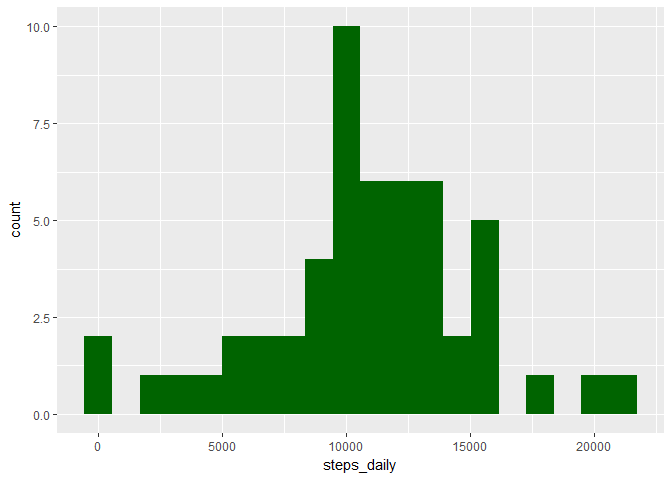
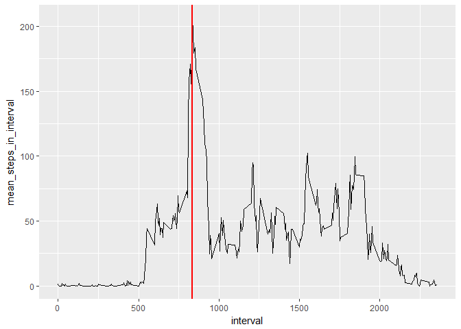
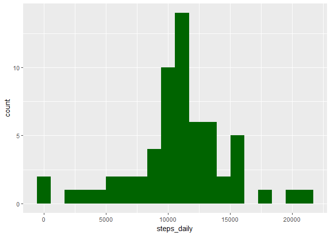
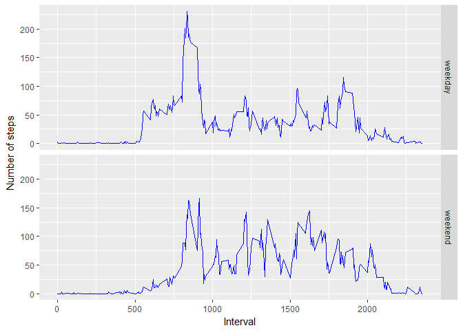

# Reproducible Research: Peer Assessment 1


## Loading and preprocessing the data

```r
list.of.packages <- c("ggplot2", "data.table", "xtable")
new.packages <- list.of.packages[!(list.of.packages %in%     
  installed.packages()[,"Package"])]
if(length(new.packages)) install.packages(new.packages)

unzip(zipfile = 'activity.zip')
activity_df <- read.csv(file = 'activity.csv')
```


## What is mean total number of steps taken per day?

```r
library(data.table)
steps_by_day <- setDT(activity_df[!is.na(activity_df$steps), ])[, list(steps_daily=sum(steps)), by = 'date']
```

```r
library(xtable)
```

```
## Warning: package 'xtable' was built under R version 3.3.3
```

```r
xt <- xtable(head(steps_by_day))
print(xt, type='html')
```

<!-- html table generated in R 3.3.2 by xtable 1.8-2 package -->
<!-- Sat Jul 15 21:38:46 2017 -->
<table border=1>
<tr> <th>  </th> <th> date </th> <th> steps_daily </th>  </tr>
  <tr> <td align="right"> 1 </td> <td> 2012-10-02 </td> <td align="right"> 126 </td> </tr>
  <tr> <td align="right"> 2 </td> <td> 2012-10-03 </td> <td align="right"> 11352 </td> </tr>
  <tr> <td align="right"> 3 </td> <td> 2012-10-04 </td> <td align="right"> 12116 </td> </tr>
  <tr> <td align="right"> 4 </td> <td> 2012-10-05 </td> <td align="right"> 13294 </td> </tr>
  <tr> <td align="right"> 5 </td> <td> 2012-10-06 </td> <td align="right"> 15420 </td> </tr>
  <tr> <td align="right"> 6 </td> <td> 2012-10-07 </td> <td align="right"> 11015 </td> </tr>
   </table>

Histogram of the total number of steps taken each day:

```r
library(ggplot2)
```

```
## Warning: package 'ggplot2' was built under R version 3.3.3
```

```r
qplot(steps_daily, data=steps_by_day, bins=20, fill = I('darkgreen'))
```

<!-- -->

Mean of the total number of steps taken per day:

```r
mean(steps_by_day$steps_daily, na.rm = TRUE)
```

```
## [1] 10766.19
```
Median of the total number of steps taken per day:

```r
median(steps_by_day$steps_daily, na.rm = TRUE)
```

```
## [1] 10765
```


## What is the average daily activity pattern?

```r
activity_pattern <- setDT(activity_df[!is.na(activity_df$steps), ])[, list(mean_steps_in_interval=mean(steps)), by = 'interval']
max_mean_steps <- activity_pattern$interval[which.max(activity_pattern$mean_steps_in_interval)]
ggplot(activity_pattern, aes(interval, mean_steps_in_interval)) + geom_line() + geom_vline(xintercept = max_mean_steps, col='red', lwd=1)
```

<!-- -->

Which 5-minute interval, on average across all the days in the dataset, contains the maximum number of steps?

```r
activity_pattern$interval[which.max(activity_pattern$mean_steps_in_interval)]
```

```
## [1] 835
```

## Imputing missing values
Calculate and report the total number of missing values in the dataset (i.e. the total number of rows with NAs)

```r
sum(is.na(activity_df))
```

```
## [1] 2304
```
Imputing strategy: use the mean for a given interval across all days.

```r
activity_df_imputed <- activity_df
missing_idx <- which(is.na(activity_df$steps))
activity_df_imputed$steps[missing_idx] <- sapply(missing_idx, function(idx) activity_pattern$mean_steps_in_interval[which(activity_pattern$interval==activity_df$interval[idx])] )
length(which(is.na(activity_df_imputed$steps))) # Verify that no missing values remained
```

```
## [1] 0
```
Histogram of the total number of steps taken each day

```r
steps_by_day_imputed <- setDT(activity_df_imputed)[, list(steps_daily=sum(steps)), by = 'date']
qplot(steps_daily, data=steps_by_day_imputed, bins=20, fill = I('darkgreen'))
```

<!-- -->

Mean of the total number of steps taken per day:

```r
mean(steps_by_day_imputed$steps_daily, na.rm = TRUE)
```

```
## [1] 10766.19
```
Median of the total number of steps taken per day:

```r
median(steps_by_day_imputed$steps_daily, na.rm = TRUE)
```

```
## [1] 10766.19
```


## Are there differences in activity patterns between weekdays and weekends?

```r
Sys.setlocale("LC_TIME","C")
```

```
## [1] "C"
```

```r
activity_df_imputed$is_weekend <- factor(x=ifelse(weekdays(as.Date(activity_df_imputed$date)) %in% c('Saturday', 'Sunday'),'weekend', 'weekday'))
# g <- ggplot(activity_df_imputed, aes(interval, steps)) + facet_grid()
activity_pattern_imputed <- setDT(activity_df_imputed)[, list(mean_steps_in_interval=mean(steps)), by = c('interval', 'is_weekend') ]
qplot(interval, mean_steps_in_interval, data=activity_pattern_imputed, facets = is_weekend~., geom='line', ylab='Number of steps', xlab='Interval', color=I('blue'))
```

<!-- -->
